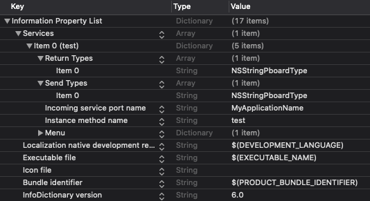

### osx开发学习-如何使用Service Provider

osx上的App并非一定要启动GUI界面才可以为用户提供服务，也可以使用`Service Provider`的方式，来提供自己的功能，这样做之后，可以做到在其他App中使用该App的功能。例如，在Finder中的文件选中后，右键点击可以看到“添加到xx笔记”这样的功能。

#### 提供功能代码

新建一个类，并且实现一个提供服务功能的函数。

```swift
class Service: NSObject {
    public func test(pboard: NSPasteboard) {
        // 示例
        print("this is test function")
    }
}
```

#### 在AppDelegate中注册Service Provider对象

```swift
@NSApplicationMain
class AppDelegate: NSObject, NSApplicationDelegate {

    func applicationDidFinishLaunching(_ aNotification: Notification) {
        NSApp.servicesProvider = Service();
    }
}
```

#### 在plist文件中向系统注册服务

在`info.plist`文件中，可以向系统注册自己的`Service Provider`，plist文件中所需要的property在文档中有比较详细的说明。但是根据现在xcode中的自动提示，当前的property的显示名字和过去有所不同（虽然本质上仍旧相同），并且过去的部分property好像被删除了。

Apple相关文档: [Services Implementation Guide](https://developer.apple.com/library/archive/documentation/Cocoa/Conceptual/SysServices/introduction.html#//apple_ref/doc/uid/10000101-SW1)



对其中一些比较令人迷惑的属性进行解释:

##### Send Types

可选数组参数，检测到选取了特定内容时触发。示例中所使用的`NSStringPboardType`即检测到选择了`String`内容时可以触发Service。
（10.15环境下，文档中注明`NSStringPboardType`被废弃，应该使用`NSPasteboardTypeString`替代，但实际测试中发现`NSStringPboardType`有效，反而是`NSPasteboardTypeString`无效）

#### 测试

因为Service信息只有在用户登录时才会进行一次收集，所以为了测试，不得不频繁登录登出，效率低。官方给出了解决方案

```bash
/System/Library/CoreServices/pbs -update # 更新service
/System/Library/CoreServices/pbs -dump # 查看service
```

更新后需要在“系统偏好设置->键盘->快捷键->服务”中将新创建的服务勾选之后才可以正常使用。
